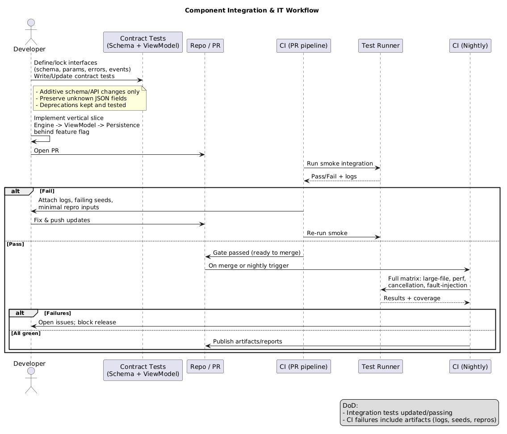

# CRC Calculator (GUI) — Requirements

## 1. Overview
A desktop GUI tool to compute CRC checksums for text and files. Supports common CRC presets (CRC‑8/16/32/64) and custom parameterization (polynomial, width, init, reflect in/out, xor‑out). Provides live recalculation, drag‑and‑drop files, streaming for large inputs with progress and cancel, and import/export of CRC profiles.

Primary target: Linux desktop.  
Architecture: MVVM.  

See acronyms and terms in the glossary: [GLOSSARY.md](./GLOSSARY.md).

## 2. Goals
- Accurate CRC computation for configurable algorithms.
- Fast, streaming processing of large files without blocking the UI.
- Simple, responsive UI with immediate feedback and validation.
- Easy reuse of CRC settings via presets and user profiles.

Out of scope:
- Network integrations, auto-update, telemetry (optional, disabled by default).
- Non-CRC hash algorithms (MD5/SHA/etc.).

## 3. Users
- Developers/engineers verifying firmware/images/logs.
- QA/testers comparing expected checksums.
- Students learning CRCs.

## 4. Functional Requirements
4.1 CRC Calculation
- Input sources:
  - Text input area (treated as bytes; UTF‑8 by default).
    text input supports format selector: String | Hex | Binary
    - String: UTF‑8 → bytes (default).
    - Hex: parse hex pairs → bytes; accept spaces/underscores and optional 0x; invalid chars flagged.
    - Binary: parse 0/1 → bytes (MSB‑first); accept spaces/underscores; require bit count multiple of 8; invalid chars flagged.
    - Live recalculation occurs only when input is valid; show parsed byte count.
  - File(s) via file picker and drag‑and‑drop.
- Output formats: Hex (uppercase/lowercase), Binary, Decimal.
- Live recalculation while typing in text mode.

4.2 Algorithms and Presets

4.2.1 Algorithm Definition
- Parameters
  - width: Number of CRC bits (1–64).
  - polynomial (poly): Generator polynomial expressed in normal (non‑reflected) form. For refin=true algorithms, the reflected form is used internally.
  - init: Initial register value (width bits).
  - refin (reflectIn): Whether each input byte is bit‑reflected before processing.
  - refout (reflectOut): Whether the final CRC value is bit‑reflected before xorOut.
  - xorOut: Value XORed with the final (optionally reflected) CRC.
- Processing rules
  - The CRC register is width bits; all intermediate results are masked to width.
  - If refin=true, each input byte is reflected (bit‑reversed) before table/bitwise step.
  - If refout=true, reflect the final CRC value (width bits) before applying xorOut.
  - Output formatting (Hex/Bin/Dec) is a presentation concern; the numeric CRC value is defined by the algorithm above.
- Verification vectors
  - “check” value: CRC of ASCII string "123456789" (no newline). Each preset publishes its check for self‑test.
- Implementation
  - Table‑driven fast path for common widths (8/16/32/64) with 256‑entry tables.
  - Bitwise fallback for any width 1–64.
- Validation
  - poly, init, xorOut must fit in width bits; reject if value ≥ 1 << width (This mean the value is out of width size).
  - width outside 1–64 is invalid.
  - When editing hex fields, accept optional 0x prefix; ignore underscores; enforce width.

4.2.2 Built‑in Presets
- CRC‑8/SMBus
  - width=8, poly=0x07, init=0x00, refin=false, refout=false, xorOut=0x00, check=0xF4
- CRC‑8/MAXIM (Dallas)
  - width=8, poly=0x31, init=0x00, refin=true, refout=true, xorOut=0x00, check=0xA1
- CRC‑16/IBM (ARC)
  - width=16, poly=0x8005, init=0x0000, refin=true, refout=true, xorOut=0x0000, check=0xBB3D
- CRC‑16/MODBUS
  - width=16, poly=0x8005, init=0xFFFF, refin=true, refout=true, xorOut=0x0000, check=0x4B37
- CRC‑16/CCITT‑FALSE
  - width=16, poly=0x1021, init=0xFFFF, refin=false, refout=false, xorOut=0x0000, check=0x29B1
- CRC‑16/X25
  - width=16, poly=0x1021, init=0xFFFF, refin=true, refout=true, xorOut=0xFFFF, check=0x906E
- CRC‑32/ISO‑HDLC (IEEE 802.3)
  - width=32, poly=0x04C11DB7, init=0xFFFFFFFF, refin=true, refout=true, xorOut=0xFFFFFFFF, check=0xCBF43926
- CRC‑32C/Castagnoli
  - width=32, poly=0x1EDC6F41, init=0xFFFFFFFF, refin=true, refout=true, xorOut=0xFFFFFFFF, check=0xE3069283
- CRC‑64/ECMA‑182
  - width=64, poly=0x42F0E1EBA9EA3693, init=0x0000000000000000, refin=false, refout=false, xorOut=0x0000000000000000, check=0x6C40DF5F0B497347

4.2.3 Preset and Profile Behavior
- Built‑in presets are read‑only.
- “Apply Preset” loads parameters into the current session.
- “Save as Profile” creates a user‑editable copy with a custom name and notes.
- Import/Export profiles as JSON. On import, preserve unknown fields for forward‑compatibility.

4.3 File Processing
- Stream-based computation (bounded memory; no full file load).
- Progress indicator (percentage, bytes processed, estimated time).
- Cancellation support; cancels within 200 ms.
- Multiple files: compute individually; per-file results list with copy/save.

4.4 Results and Actions
- Copy checksum to clipboard.
- Save report (text/CSV) including parameters and results.
- Recent items/history (last 10 inputs/files, clearable).
- Error reporting with actionable messages.

4.5 Validation
- Parameter validation with inline errors and disabled actions until valid.
- Hex input validation for polynomial/init/xorOut.

## 5. Non-Functional Requirements
- Accuracy: Golden vectors for all presets; cross-checked against reference implementations.
- Performance:
  - Process ≥1 GiB file at ≥200 MiB/s on typical modern CPU (release build).
  - Constant memory usage with respect to file size.
- Responsiveness:
  - UI remains interactive during long operations.
  - Live text recalculation latency <50 ms for typical inputs (<1 MiB).
- Reliability: Graceful handling of missing files, permissions, and I/O errors.
- Portability: Linux. Codebase portable to Windows/macOS.
- Accessibility: Full keyboard navigation; high-contrast friendly.
- Localization: English (en) default; text externalized for future i18n.

## 6. UI Requirements
- Main layout:
  - Left: Input panel (Text area with byte count; File picker + drag and drog zone; Recent items).
  - Right: Parameters (Preset dropdown; custom params editor with validation).
  - Bottom/Sidebar: Results (Hex/Bin/Dec tabs), progress bar, actions (Copy, Save Report).
- Menu/Toolbar:
  - File: Open, Save Report, Import Profiles, Export Profiles, Exit.
  - Edit: Copy, Clear, Preferences.
  - Help: About.
- Status bar: Operation status, progress, cancel button.

## 7. Data and Formats
- Profile JSON schema:
  - name: string
  - width: uint (1–64)
  - polynomial: uint64 (hex)
  - init: uint64 (hex)
  - reflectIn: bool
  - reflectOut: bool
  - xorOut: uint64 (hex)
  - notes: optional string
- Report: Plain text or CSV including timestamp, inputs, parameters, and outputs.

## 8. Persistence
- Config directory: XDG config (~/.config/CrcCalculator).
- Files:
  - settings.json (UI prefs: theme, last preset, output format).
  - profiles.json (user-defined profiles).
  - history.json (recent files/items; path opt-in).

## 9. Error Handling
- Clear messages for invalid params, unreadable files, and I/O failures.
- Non-blocking dialogs; logs available in a diagnostic pane.

## 10. Testing and QA
### Test strategy

- Objectives:
  - Prove algorithmic correctness across presets and custom params.
  - Verify UX behavior, streaming robustness, and persistence.
  - Enforce performance, responsiveness, and packaging constraints.
  #### Unit tests
  - Logic checks:
    - CrcEngine: table-driven vs bitwise parity for widths 1–64; reflectIn/reflectOut and xorOut sequencing; width masking after each step.
    - Built-in presets: golden “check” values for "123456789" (numeric equality independent of formatting).
    - Parsers/formatters: String/Hex/Binary round-trips; Hex/Bin/Dec rendering; hex case toggle; locale independence.

  - Boundary checks:
    - Width: valid {1,8,16,32,64} and invalid {0,65}.
    - Params: poly/init/xorOut at 0, max (all ones within width), single-bit and high-bit polys; values just below/above 1<<width.
    - Inputs: empty, 1 byte, typical sizes, very large buffers (chunked); binary strings with bit counts at multiples of 8 and off-by-one.
    - Formatting: hex with/without 0x, underscores, mixed case; binary with separators; max-length fields.

  - Error handling:
    - Parameter validation errors: width out of range; poly/init/xorOut ≥ 1<<width; precise messages and error codes/exceptions.
    - Parser errors: invalid chars, odd hex digits, non-multiple-of-8 bits, numeric overflow; partial input does not trigger recalculation.
    - Profile JSON: missing/invalid types rejected; unknown fields preserved on round-trip.
    - Ensure no unhandled exceptions leak; consistent error mapping across APIs.

  - Object-oriented checks:
    - Class invariants: CrcEngine cannot be constructed with invalid params; presets are read-only/immutable.
    - Copy/move/equality: CrcEngine/Profile copy/move semantics correct; equality/hash stable; default constructors produce valid states.
    - Lifecycle: reset/reuse yields identical results; no hidden global state; thread-safety of independent instances.
    - MVVM units: command enablement toggles on validation changes; single notification per change; no memory/resource leaks (sanitizers).

  - Property-based/fuzz:
    - Random width/poly/init/xorOut/reflect flags within bounds; compare against a slow reference implementation.
    - Random byte streams (including empty and very large); failing cases shrink to minimal counterexamples; seeds recorded.

  - Reliability/determinism:
    - Same input/params → same CRC across runs/platforms (endianness-agnostic).
    - Table vs bitwise equivalence across all supported widths.

  - Code coverage:
    - Targets: ≥95% lines/branches for CrcEngine; ≥85% overall.
    - Cover all preset definitions, parser success/error paths, and validation branches.
    - Exclude GUI glue, platform stubs, and generated code; enforce thresholds in CI with coverage reports.

#### Integration tests

- Scope and principles
  - Validate seams between CrcEngine, parsers/formatters, file streaming, persistence, and ViewModel (lightweight GUI via MVVM). Keep tests deterministic, isolated, and fast; end-to-end UI kept minimal.
  - Contract-first: lock JSON profile schema and ViewModel command/events; add contract tests before implementation changes.

- Environment and isolation
  - Headless GUI via Xvfb; locale=C, timezone=UTC; deterministic seeded RNG; network disabled.
  - Temporary working dirs; set XDG_* to per-test folders; clean up on exit.
  - Fake/abstract clock and timers to assert progress and ETA (Estimated Time Remaining) deterministically.
  - Large-file generators (patterned/random) streamed from temp files; verify constant memory usage.

- Techniques and scenarios
  - File processing
    - Streaming on large files (≥1 GiB) with bounded memory; vary chunk sizes; verify monotonic percent/bytes/ETA; cancellation ≤200 ms; per-file results list; Copy/Save Report paths; results match reference.
    - Fault injection: unreadable files, permission denied, short reads, disk full on report save; assert actionable errors and no resource leaks.
  - ViewModel and MVVM flows
    - Command wiring (Apply Preset, Save as Profile, Import/Export) with state-machine assertions: enable/disable transitions on validation and busy states.
    - Validation disables actions until valid; clear inline errors; no recalculation on invalid input.
    - History/persistence under XDG config; opt-out disables path storage; round-trip settings.
    - Concurrency: compute + cancel + immediate re-run; idempotent cancel; UI remains responsive (event loop not blocked).
  - Profiles and schema contracts
    - Built-ins read-only; Apply Preset loads params; Save as Profile adds editable copy with name/notes.
    - JSON import/export round-trips and preserves unknown fields; backward/forward-compatibility tests pinned to a versioned schema.
  - Cross-implementation parity
    - Table vs bitwise engine parity at integration level for widths 8/16/32/64 on random streams; seeds recorded on failure.
  - Performance gates
    - Throughput ≥200 MiB/s on ≥1 GiB (release build); warm-up runs; isolate I/O from CPU by pinning to tmpfs if available.

- Component integration workflow
  - Contract-first interfaces: define/document parameters, error codes, and events; write/lock contract tests (profile JSON schema, ViewModel commands/events) before changes.
  - Vertical slices: integrate Engine → ViewModel → persistence per feature behind feature flags; add slice-level integration tests with fixtures.
  - Pull Request (PR) gating: run fast smoke integration on each PR; run full matrix/nightly suites for large-file, performance, cancellation, and fault-injection.
  - Compatibility discipline: make schema/API changes additive; keep deprecations with tests that ensure legacy data loads; preserve unknown JSON fields on round-trip.
  - Definition of Done: integration tests added/updated; CI failures attach artifacts (logs, failing seeds, minimal repro inputs).

  The Integration workflow are captured as below.
  

- CI execution
  - Per-PR: headless GUI smoke, schema contracts, small/medium files, command state-machine, import/export.
  - Nightly: ≥1 GiB streaming, performance gates, cancellation stress, fault injection, parity, persistence longevity tests.

#### Acceptance tests

- Approach
  - Black-box focus from user workflows.
  - Test design uses Equivalence Partitioning (EP), Boundary Value Analysis (BVA), and Decision Table (DT) testing for inputs, validation, and command enablement.

- Acceptance types and responsibilities
  - User Acceptance Testing (UAT): target personas validate end-to-end tasks (compute checksums, copy/save, profile import/export, large-file runs).
  - Alpha Testing: internal team on supported Ubuntu images; blocks Beta.
  - Beta Testing: small external cohort with real workloads; feedback tracked as issues.
  - Contract Acceptance Testing (CAT): lock/profile JSON schema and ViewModel command/events; verify backward/forward compatibility and unknown-field preservation.
  - Regulation Acceptance Testing (RAT): no external regulatory obligations assumed; verify license notices and privacy/offline guarantees.
  - Operational Acceptance Testing (OAT): install/upgrade/rollback, startup time, offline operation, resource bounds, logging, and desktop integration.

- Scenarios and technique mapping
  - Preset correctness [Black-box]:
    - For each built-in preset, CRC("123456789") equals documented check and matches a trusted reference.
  - Text input UX [EP, BVA, Black-box]:
    - Live recalculation only when valid; byte count equals parsed bytes.
    - Partitions: String/Hex/Binary valid sets; invalid chars; separators/prefixes.
    - Boundaries: empty, 1 byte, typical, large; Binary bit counts at multiples of 8 and off-by-one.
    - Outputs render Hex/Bin/Dec; hex case toggle.
  - Parameters/validation [BVA, EP, DT, Black-box]:
    - Width invalid {0, 65}; valid {1, 8, 16, 32, 64}.
    - poly/init/xorOut at 0, max ((1<<width)-1), just below/above 1<<width; 0x prefix, underscores; width masking enforced.
    - Decision tables for action enablement vs validity and busy/cancel states; clear error messages.
  - File processing [OAT, Black-box, BVA]:
    - ≥1 GiB streaming; progress/ETA monotonic; cancel ≤200 ms; constant memory; results match reference.
    - Multiple files → per-file results; Copy/Save Report succeed; fault cases reported cleanly.
  - History/persistence [CAT, OAT, Black-box]:
    - Recent items tracked/clearable; settings/profiles/history under XDG; opt-out honored; schema round-trip preserves unknown fields.
  - Accessibility/responsiveness [UAT, OAT, Black-box]:
    - UI interactive under load; cancel responsive; live typing latency <50 ms; full keyboard navigation; high-contrast friendly.
  - Packaging smoke (Ubuntu 20.04+) [OAT]:
    - AppImage launches without system Qt; offline only; startup ≤1 s; drag-and-drop works; published SHA256 verifies.
  - Contract acceptance [CAT]:
    - Validate JSON schema versioning, required/optional fields, type checks, and unknown-field preservation across Import/Export.

- Test data
  - Golden vectors for all presets; parser corpora (valid/invalid); synthetic large files (patterned/random).

- Entry/exit
  - Entry: integration suites green; artifacts built.
  - Exit: aligns with “Exit criteria” section (no P0/P1, performance targets met, packaging smoke passes); Product Owner sign-off after UAT.

#### Non-functional and performance
- Throughput: ≥200 MiB/s on ≥1 GiB file (release build, typical CPU).
- Constant memory vs file size.
- Startup ≤1 s; no network access.
- Golden vectors cross-checked against reference tools.

#### Automation and tooling
- Continuous integration
  - Build Debug with Address Sanitizer and Undefined Behavior Sanitizer and Release with full optimizations. Run unit, integration, and acceptance suites headless using Xvfb for the GUI.
  - Enforce code coverage thresholds: at least 85 percent overall and at least 95 percent for CrcEngine.
  - Run static analysis with clang tidy and cppcheck. Enforce formatting with clang format and CMake presets.
  - Cache dependencies to speed up builds. On failure, archive logs, coverage, and minimal repro inputs.
- Artifacts
  - AppImage artifact: self-contained Linux executable (CrcCalculator-${VERSION}-x86_64.AppImage).
  - Integrity: publish SHA256 checksum file; attach a GPG signature (.sig) and include the public key fingerprint in the release notes.
  - CI attachments: build logs, test reports (unit/integration/acceptance in JUnit XML), and code coverage (HTML and summary).
  - Static analysis outputs: clang-tidy and cppcheck reports.
  - Release files: LICENSE and CHANGELOG.

#### Test data and fixtures
- Golden vectors for all presets.
- Synthetic large files generated on demand with patterned and random content.
- Parser corpus covering valid and invalid Hex and Binary strings and edge widths.

#### Manual checklist
- Drag and drop, live typing behavior, and profile import and export.
- Large file at least 5 GiB stream with cancel and resume scenarios.

#### Exit criteria
- Acceptance suite passes completely and performance targets met.
- No open P0 or P1 defects and coverage thresholds met.
- Packaging smoke tests pass on Ubuntu 20.04 or newer.
- All artifacts published with checksums and changelog.

## 11. Build and Tooling
- Language: C++23.
- Build: CMake; Release and Debug configurations, sanitizers enabled in Debug.
- Dependencies:
  - GUI: Qt 6 (Core, Widgets, Gui, Concurrent)
  - JSON: Qt JSON API (QtCore: QJsonDocument/QJsonObject/QJsonArray)
- Packaging helpers:
  - AppImage: use linuxdeploy (with plugin.qt) to stage the AppDir, then appimagetool to build the final .AppImage (Qt and runtime bundled).
  - CPack: enable DEB packaging via CPACK_GENERATOR=DEB with metadata set in CMake; off by default and used only for CI/local DEB builds.

## 12. Security and Privacy
- No network access by default.
- File paths and history stored locally with an opt out setting to disable history.
- No telemetry by default.

## 13. Acceptance Criteria
- Compute correct checksums for built in presets with all golden tests passing.
- Live text updates and clipboard copy work.
- Large file processing shows progress and supports cancel.
- Profiles can be created, saved, imported, and exported.
- UI remains responsive under load with no crashes in basic workflows.

## 14. Deployment

14.1 Packaging Strategy simple by default
- Primary format: AppImage single executable containing the app and all required Qt and runtime libraries.
- Optional formats:
  - Deb package via CPack for Debian and Ubuntu users.
  - Flatpak manifest for future Flathub distribution in a sandbox with minimal permissions.

14.2 End User Install Experience
- AppImage:
  - Install: download the file, run chmod plus x on it, then run it. No root required. First run may offer desktop integration such as menu entry and icon.
  - Uninstall: delete the AppImage file. If integrated, remove generated desktop and icon files or use the integration tool remove option.
- Deb:
  - Install: run sudo apt install with the Deb file name from the directory that contains it or provide an absolute path.
  - Uninstall: run sudo apt remove crc-calculator.
- Flatpak future:
  - Install: flatpak install flathub org.example.CrcCalculator.
  - Uninstall: flatpak uninstall org.example.CrcCalculator.

14.3 Distribution Channels
- GitHub Releases:
  - Assets: AppImage, SHA256 checksum file, optional GPG signature, LICENSE, README, CHANGELOG.
  - Release notes summarize changes and known issues.
- Optional:
  - APT repository or PPA for Deb packages.
  - Flathub for Flatpak when ready.

14.4 Compatibility Requirements
- Architecture: x86_64 Linux.
- glibc baseline: build on Ubuntu 25.04 to maximize compatibility across distributions.
- Rendering and display (Qt 6 Widgets):
  - No hard OpenGL requirement; the Qt raster paint engine is the default.
  - Uses hardware acceleration when available (OpenGL 2.1 or OpenGL ES 2.0+); falls back to software (Mesa llvmpipe or Qt software backend) without user action.
  - Runs on X11 (xcb) and Wayland; headless CI supported via Xvfb. QT_QPA_PLATFORM can be set to xcb or wayland if needed; LIBGL_ALWAYS_SOFTWARE=1 forces software rendering.
  - AppImage bundles Qt platform plugins (xcb/wayland) but relies on host GPU drivers (libGL/Mesa not bundled). No Vulkan/ANGLE required.
- No system Qt required for AppImage and all dependencies must be bundled.

14.5 Security, Integrity, and Trust
- Publish SHA256 checksums for each artifact.
- Optionally sign the AppImage and the checksum file with a GPG release key and publish the fingerprint in README.
- Users can verify:
  - sha256sum CrcCalculator-*.AppImage
  - gpg --verify CrcCalculator-*.AppImage.sig CrcCalculator-*.AppImage

14.6 Updates and Rollback
- AppImage: manual updates by downloading a newer file. Older versions remain usable side by side. Optional zsync for delta updates.
- Deb: updates delivered via apt if a repository is provided. Support rollback to a previous version via the package manager.
- Keep at least the last two minor versions available in Releases with a clear CHANGELOG.

14.7 Size and Performance Constraints
- AppImage target size: at most 100 MB if feasible. Strip binaries and remove unused Qt modules.
- Startup time: at most 1 second on a typical desktop cold start.
- Runtime must function fully offline with no network access.

14.8 Desktop Integration and UX
- Bundle a desktop file, a 256 by 256 icon, and a MIME type for profile files with extension crcprofile.json.
- AppImage and packaging must ensure:
  - Proper desktop entry in menus.
  - File associations for profile import optional.
  - Drag and drop works without additional system packages.

14.9 Privacy and Offline Use
- No telemetry and no outbound network calls.
- History and settings stored under XDG directories in the user home with an easy opt out for history.

14.10 Release Requirements
- Use Semantic Versioning MAJOR dot MINOR dot PATCH.
- Name artifacts consistently: CrcCalculator-${VERSION}-x86_64.AppImage.
- Each release must include artifacts, checksums, LICENSE, and CHANGELOG.
