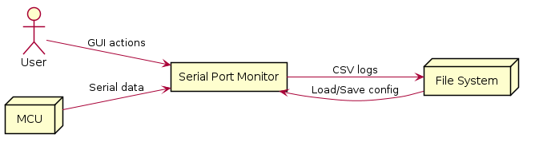
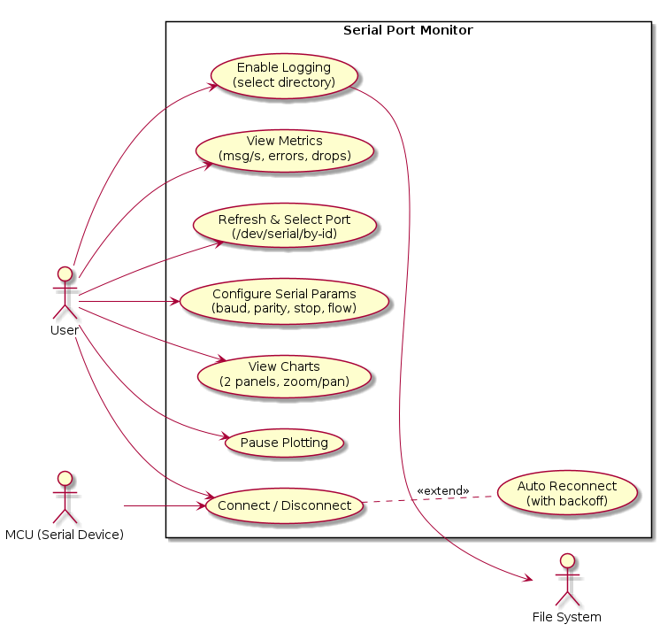
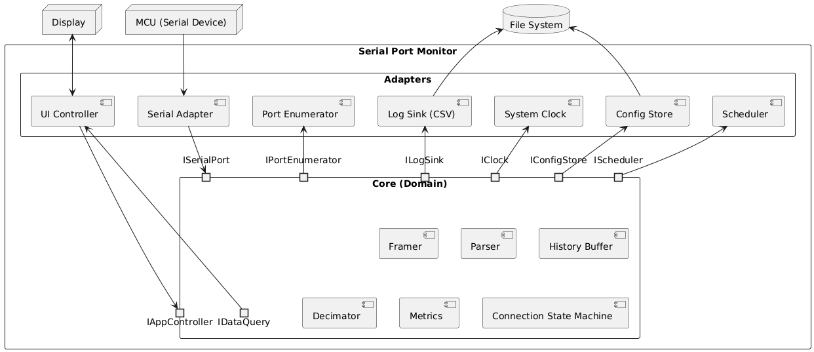
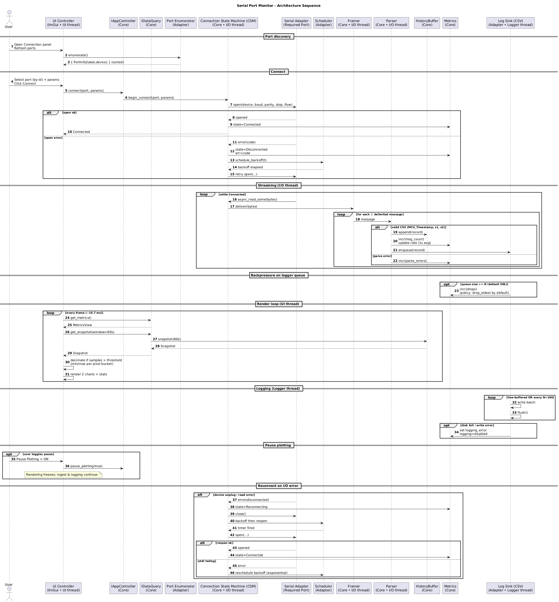
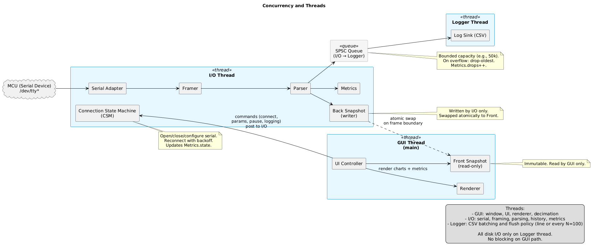

# Software Architecture Document (SAD)

Version: 1.0  
Date: 20 Aug 2025  
System: Serial Port Monitor  
Author: Dezus  
Style: Hexagonal (Ports & Adapters) + Event‑driven pipeline

## 1. Purpose and Scope
- Purpose: define the architecture that fulfills the SRS for a real‑time serial data monitor with robust logging and portable GUI.
- Scope: Ubuntu Desktop and Embedded Linux (e.g., Raspberry Pi). C++23.

## 2. System Overview
- Receives real-time data from an MCU over UART; frames/parses messages into records; visualizes two sensor channels; logs to CSV; shows metrics; auto-reconnects on errors.
- Three threads: I/O thread, GUI thread (main thread), Logger thread.
- Bounded queues, snapshots, and render decimation maintain responsiveness.

## 3. Architecture Drivers
- Functional: serial config (baud, parity, stop, flow), discovery (/dev/serial/by-id), connect/reconnect, parsing, charts, logging.
- Quality attributes: low latency (<100–150 ms), steady FPS, bounded memory, portability, testability, reliability.
- Constraints: OpenGL/ES, GLFW with SDL2 fallback, Boost.Asio, ImGui/ImPlot.

## 4. Software Architecture Solution
### 4.1 Solution Strategy
- Hexagonal boundaries: domain core independent of OS/GUI; ports define contracts; adapters provide implementations.
- Event‑driven pipeline: async I/O → framing → parsing → fan‑out (history, logger, metrics).
- Backpressure with bounded SPSC queues; drop‑oldest policy; render decimation per pixel bucket.
### 4.2 Architectural Alternatives & Rationale

Current chosen style
- Hexagonal (Ports & Adapters) + Event-driven pipeline
  - Rationale: clean portability (GLFW↔SDL, GL↔GLES, real UART↔PTY simulator), high testability (mock ports), fits async serial + GUI rendering with bounded queues and backpressure.
  - Pros: swappable adapters; explicit contracts; easy simulator/testing; good performance via decimation and SPSC queues.
  - Cons: more interfaces/boilerplate; higher initial design complexity.

Alternatives considered
- Layered Architecture (Presentation/Domain/Infrastructure)
  - Pros: simple, familiar, fast to start.
  - Cons: tighter coupling to frameworks; harder to swap backends; async I/O/backpressure cuts across layers; weaker test isolation.
- MVC/MVVM (UI-centric)
  - Pros: good UI separation/binding.
  - Cons: does not solve serial streaming pipeline/backpressure; risks domain logic on UI thread; portability issues remain.
- Actor Model (e.g., CAF/SObjectizer)
  - Pros: isolation, supervision, mailbox backpressure.
  - Cons: heavier runtime, learning curve, potential overhead; overkill for current scope.
- Reactive Streams/Rx (RxCpp)
  - Pros: expressive pipelines, backpressure semantics.
  - Cons: template-heavy, harder debugging, steep learning; not necessary for modest flows.
- Split Processes/Microservices
  - Pros: crash/privilege isolation.
  - Cons: IPC latency/complexity, packaging/deployment overhead; unnecessary for single-node app.

## 5. Context View
### 5.1 System context Explanations

- External actors/systems:
  - User: interacts via GUI (select port, configure serial, view charts, toggle logging).
  - MCU (serial device): sends CSV messages over UART (/dev/tty*), may disconnect/reconnect.
  - File System: persists CSV logs and configuration.
- System boundary: The "Serial Port Monitor" app encapsulates the GUI, domain core (framer, parser, Connection State Machine (CSM), metrics), and adapters (serial I/O, logging, window/render). Only the serial device and the file system sit outside the boundary.
- Interaction overview:
  - MCU → App: serial bytes (CSV messages terminated by ‘;’).
  - User ↔ App: UI commands/events and visual feedback (charts, status, metrics).
  - App ↔ File System: write CSV logs (flush policy), read/write config.

### 5.2 Use Case Explanations
The main user interactions and external systems are captured below.

**Use Case Explanations:**
- Refresh & Select Port: Present available serial ports; support refreshing the list; allow the user to select a port.
- Configure Serial Params: Set baud, parity, stop bits, and flow control; validate combinations; remember last used.
- Connect / Disconnect: Open/close selected port; surface status and errors.
- Auto Reconnect: On I/O error/unplug, retry with exponential backoff until success or user cancels.
- View Charts: Two sensor panels with 60 s rolling history; supports zoom/pan and decimation for FPS.
- Pause Plotting: Freeze chart updates while continuing data ingest and logging.
- Enable Logging: Choose directory; create timestamped CSV with header; apply flush policy (line or every N=100).
- View Metrics: Display messages/s (1 s average), parse/frame errors, queue drops, and connection state.

## 6. Component Structure View
The components structure are captured below.

### 6.1 Diagram explanation
- **Core (Domain)**
  - Domain components
      - Framer: accumulate bytes, find ‘;’ delimiter, enforce max frame size, resync on corruption.
      - Parser: CSV → DataRecord; validate 3 fields (int64/float/float), count parse errors.
      - History Buffer: rolling 60 s store per channel; drop-oldest; snapshot API for UI.
      - Decimator: render-only downsampling (min/max per pixel bucket; stride fallback).
      - Metrics: messages/s (1 s avg), parse/frame errors, queue drops, connection state.
      - Connection State Machine (CSM): connect/disconnect; apply params; auto-reconnect with exponential backoff.
  - Provided ports (Core → UI drivers)
    - IAppController: entry points for user intents (connect/disconnect, set serial params, toggle logging, pause plotting).
    - IDataQuery: read-only access to immutable snapshots and metrics for rendering.
  - Required ports (Core → infrastructure adapters)
    - ISerialPort: open/configure/close port; async byte stream and error signaling.
    - IPortEnumerator: list stable port labels and resolve to device paths.
    - ILogSink: open session, write batches, flush (line or every N), close; surface disk errors.
    - IClock: wall/monotonic time for timestamps and rate calculations.
    - IConfigStore: load/save last-used settings (port, baud, log dir, UI prefs).
    - IScheduler: timers for reconnect/backoff and cancellations.

- **Adapters (tech-agnostic names)**
  - UI Controller: renders controls (port list, params, connect, logging, pause) and charts/metrics; calls IAppController/IDataQuery.
  - Serial Adapter: implements ISerialPort; opens/configures serial, performs async reads/writes, detects unplug/errors.
  - Port Enumerator: implements IPortEnumerator; lists /dev/serial/by-id (or platform equivalent) and resolves device paths.
  - Log Sink (CSV): implements ILogSink; creates timestamped CSV, writes header and rows, applies flush policy.
  - System Clock: implements IClock; provides system/monotonic timestamps.
  - Config Store: implements IConfigStore; persists and loads settings.
  - Scheduler: implements IScheduler; provides timers for reconnect/backoff.

- External systems
  - MCU (Serial Device): byte stream source for Serial Adapter.
  - File System: destination for CSV logs and configuration.
  - Display: window/framebuffer target used by the UI layer.

## 7. Runtime/Sequence View
The sequence architecture are captured as below.

## 8. Concurrency and Threads

The Concurrency and Threads are captured as below.

Goal: keep UI responsive (<16.7 ms/frame), bound memory, and ensure reliable ingest/logging under steady 115200 baud.

8.1 Thread model and responsibilities
- GUI thread (main thread)
  - Owns window, ImGui/ImPlot, and renderer.
  - Renders charts and status; polls Core via IDataQuery once per frame.
  - Sends user intents via IAppController (connect/disconnect, params, pause, logging).
  - Applies render-only decimation and never blocks on I/O or disk.
- I/O thread
  - Runs io_context and Connection State Machine (CSM).
  - Owns Serial adapter lifecycle (open/config/close), async_read loop.
  - Framing and Parsing: bytes → messages (‘;’) → DataRecord.
  - Writes to HistoryBuffer (writer-only) and updates Metrics.
  - Enqueues records for logging to the logger queue.
- Logger thread
  - Consumes the logging queue; writes CSV in batches.
  - Applies flush policy: line-buffered or every N=100 (default).
  - On disk error: disables logging and flags Metrics for UI.

8.2 Queues, history, and backpressure
- History (I/O → GUI)
  - HistoryBuffer is a time-capped ring per channel (default 60 s).
  - Single-writer (I/O) → snapshot for readers (GUI) via double-buffer:
    - I/O fills “back” buffers; on frame boundary, Core atomically swaps pointers.
    - GUI reads immutable “front” buffers without locks.
- Logging queue (I/O → Logger)
  - Bounded SPSC queue of DataRecord (default capacity: 50k).
  - Backpressure policy: drop-oldest by default (configurable); increment drop counter in Metrics.
- Rationale
  - Prevents unbounded memory growth.
  - Avoids blocking the I/O thread on disk; keeps UI lock-free.

8.3 Synchronization and ownership
- Only the I/O thread mutates HistoryBuffer live structures; GUI reads snapshots only.
- Metrics counters are updated by I/O/Logger threads and read by GUI:
  - Use atomics for simple counters/gauges; aggregate rates over ~1 s sliding window in I/O.
- No blocking calls in GUI path; all blocking/disk work is on Logger thread.
- Port contracts declare thread affinity:
  - IAppController/IDataQuery are called from GUI; Core marshals to I/O as needed.
  - ISerialPort is used only on I/O; ILogSink only on Logger.

8.4 Lifecycle and shutdown
- Startup
  - GUI thread starts first (main).
  - I/O thread starts io_context lazily on first connect, or eagerly at app init (both supported).
  - Logger thread starts when logging is enabled; reuses between sessions if kept on.
- Shutdown order
  1) GUI requests stop: IAppController.disconnect(), set logging=false.
  2) Logger thread: flush, close file, join.
  3) I/O thread: CSM closes serial, stops io_context, join.
  4) Release resources; persist config via IConfigStore.
- Cancellation
  - IScheduler returns tokens for timers; CSM cancels timers on disconnect to avoid stray callbacks.

8.5 Error handling and reconnect
- Serial read/open errors signal CSM:
  - State → Reconnecting; schedule exponential backoff (e.g., 250 ms, 500 ms, … up to 5 s with jitter).
  - While reconnecting, UI remains responsive; logging continues if enabled and data still arrives (e.g., from simulator).
- Disk errors in Logger:
  - Stop logging; surface error to UI via Metrics; keep ingest and rendering unaffected.

8.6 Timing and latency budget (targets from SRS)
- End-to-end display latency: median <100 ms, p95 <150 ms.
- GUI frame: ~16.7 ms @60 FPS; decimation limits points rendered to O(pixels).
- I/O loop: async_read_some processes bytes within microseconds per record; no blocking operations.
- Logger flush: every N=100 (default) or line-buffered; accept up to N lost records on crash (trade-off).

8.7 Thread priorities and naming (Linux)
- Optional niceness:
  - GUI thread: normal (nice 0) with VSync on; disable VSync for latency tests if needed.
  - I/O thread: keep at nice 0; avoid RR unless justified.
  - Logger thread: slightly lower priority (nice +2) to favor UI and I/O.
- Name threads for observability:
  - pthread_setname_np: "gui", "io", "logger".

8.8 Configuration knobs (exposed via config/UI)
- history_window_sec: default 60 (per chart).
- decimation_threshold: max points ≈ 2 × plot width in pixels (per panel).
- log_queue_capacity: default 50_000 records.
- drop_policy: oldest | newest (default oldest).
- flush_policy: line | every_n (default every_n=100).
- reconnect_backoff: initial, max, jitter%.

8.9 Minimal orchestration sketch

- Thread startup
  - GUI main: run_window_loop()
  - I/O: io_context.run()
  - Logger: while (enabled) dequeue_batch(); write; flush_by_policy()
- Snapshot swap
  - I/O: if (frame_time_elapsed) atomic_swap(back, front)
  - GUI: read front snapshot; never touch back
- Posting UI intents
  - IAppController.connect(): post to io_context; CSM handles open/config.

8.10 Testing under concurrency
- Unit: Framer/Parser with deterministic byte sequences.
- Integration: PTY simulator → ingest → history/logging; verify drops under artificial queue saturation.
- Soak: 10+ minutes at 115200 baud; assert p95 latency <150 ms; no missed flushes on rotation.

## 9. Data View (Data Model & Formats)
- Incoming message: CSV terminated by ‘;’; newlines ignored; max 128 bytes.
- Fields: MCU_Timestamp (int64 ms since epoch), Sensor1 (float), Sensor2 (float); dot decimal.
- Parser: trims whitespace; rejects wrong field count or non‑numeric; counts parse errors.
- Log CSV header (recommended):
  - System_Timestamp(ISO8601 ms UTC), MCU_Timestamp(ms), Sensor1, Sensor2
- Flush policy: line‑buffered or every N=100 (configurable).

## 10. State Machine View
- States: Disconnected, Connecting, Connected, Reconnecting.
- Triggers: user Connect/Disconnect; I/O errors; timers for backoff.
- Diagram: docs/plantuml/state_machine.puml

## 11. Data Flow View
- Bytes → Framer → Parser → {HistoryBuffer, Logger Queue, Metrics}
- GUI: Snapshot → Decimator → Renderer
- Diagram: docs/plantuml/dataflow.puml

## 12. Timing View
- GUI frame ~16.7 ms @60 FPS.
- Logger flushes batched writes; risk: lose up to N unflushed records on crash.
- Latency target: median <100 ms, p95 <150 ms.
- Diagram: docs/plantuml/timing.puml

## 13. Deployment View
- Targets: Ubuntu x86_64 (OpenGL 3.3 + GLFW), Raspberry Pi (OpenGL ES 3 + GLFW or SDL2).
- Device access: /dev/serial/by-id; udev/group permissions documented.

## 14. Configuration & Persistence
- IConfigStore (FileConfig) persists last port, baud, log directory, UI prefs.
- Config loaded on startup, saved on exit.

## 15. Error Handling & Reliability
- Parser/framer errors counted; oversized frames dropped.
- Reconnect with exponential backoff.
- Disk‑full/write errors disable logging and notify UI.

## 16. Security Considerations
- Least privilege for serial device access (dialout group, udev rules).
- Validate all input; avoid buffer overflows; safe parsing and bounds checks.

## 17. Observability
- Metrics: msg/s (1s average), parse/frame errors, drops, connection state.
- Optional: debug logs via spdlog/fmt; log file rotation configurable later.

## 18. Build & Dependencies
- C++23; Boost.Asio; ImGui/ImPlot; GLFW/SDL2; OpenGL/ES; fmt; optional spdlog.
- Platform packages: libglfw3-dev or libsdl2-dev, OpenGL/ES headers, plantuml/graphviz for docs.

## 19. Testing Strategy
- Unit: Framer, Parser, Decimator, HistoryBuffer.
- Integration: PTY simulator + parsing/logging pipeline; reconnect scenarios.
- UI smoke: start, connect to simulator, render charts for N minutes.

## 20. Risks & Mitigations
- GUI performance at high sample rates → decimation + bounded history.
- Platform GL differences → renderer abstraction GL3 vs GLES3.
- Permission issues → document udev rules and group membership.

## 21. Architectural Decisions (ADR Summary)
- Style: Hexagonal + event‑driven (ADR‑001).
- Queues: bounded SPSC with drop‑oldest (ADR‑002).
- Renderer: GL3 desktop, GLES3 RPi (ADR‑003).
- Windowing: GLFW primary, SDL2 fallback (ADR‑004).

## 22. Open Issues & Future Work
- Optional hardware flow control UX.
- Dynamic channel count and schema evolution.
- Export/import sessions; unit selection; locale handling.

## 23. References
- SRS: docs/REQUIREMENTS.md
- Diagrams: docs/plantuml/*.puml